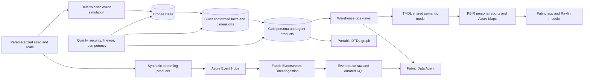

# Airport Operations Demo for Microsoft Fabric

Production-style, deterministic Microsoft Fabric airport-operations demonstration using 18 configurable public airport reference anchors across France, Italy, Portugal, and Jordan. The fictional organization and portfolio relationship, all infrastructure, airlines, aircraft, flights, passengers, employees, operations, transactions, incidents, recommendations, and outcomes are synthetic.

> Real airport identities are used only as public geographic reference anchors. All ownership, infrastructure, flights, passengers, employees, operations, performance, incidents, commercial activity, recommendations, and outcomes are synthetic.
>
> Recommendations are advisory, include evidence/freshness/confidence, and require human review. No component can control ATC, AODB, BHS, BMS, aircraft, equipment, operational technology, or workforce systems.

## Architecture



## Modeled domains

- Fictional headquarters in France and fictional portfolio relationships across France, Italy, Portugal, and Jordan
- Fictional airports, airlines, region codes, time-zone assignments, and aircraft types
- Synthetic terminals, zones, checkpoints, gates, stands, runways, routes, airline service, fleets, flights, legs, and turnaround tasks
- Pseudonymous employees, work/maintenance teams, rosters, passenger tokens, bookings, and baggage journeys
- Passenger queues, zone occupancy, retail outlets/products/POS, weather, energy, assets, maintenance, and incidents
- Aggregate customer experience, synthetic ticket/retail revenue, data quality, capacity, and cost proxies

Default configuration: environment `dev`, resource prefix `fao-demo`, seed `42`, fixed start `2026-01-01T00:00:00Z`, `smoke` profile, 18 airport anchors, 30 days, dry-run deployment, disabled destructive operations, and disabled external adapters. Select `unit`, `smoke`, `demo`, or `enterprise` through versioned configuration or notebook parameters.

## Repository outputs

| Area | Artifacts |
|---|---|
| Deployment | Preflight `00_Validate_Prerequisites`, bootstrap `00_Deploy_Fabric_Items`, `10`, `11`, `13`, optional `14` and `16`, and read-only status notebook `15`; [deployment/manifest.json](deployment/manifest.json) |
| Medallion | Notebooks `01`-`09` for base, physical/spatial, and enterprise Bronze/Silver/Gold |
| Fictional reference | [data/reference](data/reference/) generator, catalogs, and source manifest |
| Validation | Notebooks `06` and `12`; local [tests/validate_platform.py](tests/validate_platform.py) |
| Eventhouse | [eventhouse](eventhouse/) KQL schema, mappings, functions, update policies, materialized views, validation |
| Streaming | Synthetic [Event Hubs producer](src/streaming/producer.py), [source registry template](config/streaming_sources.example.json), and Eventstream DirectIngestion into the Eventhouse raw tables |
| Warehouse | [warehouse](warehouse/) schemas, curated views, roles/grants, KPI checks, teardown |
| Semantic model | TMDL projects [AirportOpsSharedModel.SemanticModel](semantic-model/AirportOpsSharedModel.SemanticModel/) (29 tables, 11 perspectives) and [EASARegulatoryModel.SemanticModel](semantic-model/EASARegulatoryModel.SemanticModel/) |
| Reports | Generated PBIR project with 11 persona and 15 detail pages [AirportOpsPersonaReports.Report](reports/AirportOpsPersonaReports.Report/), plus [EASAComplianceReports.Report](reports/EASAComplianceReports.Report/) and the RDL [paginated report](paginated-reports/) |
| App | [fabric-app/app-manifest.json](fabric-app/app-manifest.json) and configurable [fabric-app/rayfin-module.json](fabric-app/rayfin-module.json) |
| Infrastructure | Verified `microsoft/fabric` Terraform workspace and core items under [infra](infra/), plus Bicep for the streaming platform and Azure Digital Twins |
| Data Agent | [data-agent/definition.json](data-agent/definition.json), evaluations, ontology, synonyms, source mappings, instructions |
| Spatial | Twelve generated WGS84 GeoJSON layers under [geospatial/azure-maps](geospatial/azure-maps/) |
| Digital twin | 15 DTDL `;1` interfaces plus 5 `;2` observed-state interfaces, sample twins/relationships, an 18-airport 3D scene package, and optional REST deployment notebook |
| Regulatory | EASA notebooks `17`-`18`, [governed configuration](config/easa_requirements_matrix.json), Warehouse schema/views/security, and Data Factory pipeline definitions |
| Knowledge graph | Versioned [OWL/RDF ontology](ontology/README.md), SHACL shapes, Warehouse mappings, representative instances, and SPARQL queries |
| Documentation | Architecture, runbook, dictionary, lineage, assumptions, API support, rollback, troubleshooting, limitations |

## Personas and KPIs

| Persona | Primary experience |
|---|---|
| Executive | Operational risk, network outcomes, synthetic commercial indicators |
| Regional | Region comparison across the four operating regions |
| Airport | Network/airport health, queues, baggage, customer experience, Azure Maps |
| Airline | Punctuality, load factor, route performance, baggage, ticket revenue proxy |
| Operations | Turnaround phases, gate utilization, flow, staffing coverage, incidents |
| Maintenance | Asset availability, anomalies, open maintenance, team coverage |
| Commercial | POS transactions, net revenue proxy, basket value, revenue per passenger |
| Sustainability | Energy, water, and emissions proxies |
| Compliance | Incidents and regulatory preparation |
| Customer Experience | Synthetic CSAT/NPS proxies and service recovery |
| IT | Data quality, refresh/freshness, lineage, security status, capacity/cost proxies |

KPIs include on-time departure, turnaround and milestone adherence, gate utilization, passenger wait/throughput, baggage exceptions/SLA, staffing coverage, maintenance/availability, energy per flight/passenger, incidents, synthetic revenue, satisfaction, and NPS proxy.

## Quick start

Review [prerequisites](docs/prerequisites.md) and [known issues](docs/known-issues.md) before deployment.

### 1. Local portable validation

```powershell
python -m pip install -r requirements.txt
python ontology/generate_ontology.py --check
python ontology/validate_ontology.py
python tests/validate_platform.py
```

This verifies source artifacts only. It does not claim tenant deployment.

### 2. Bootstrap Fabric items

Make the repository available to Fabric through Git integration or a OneLake Files bundle. Run notebook `00_Deploy_Fabric_Items` first with `dry_run = True`, then with a runtime `workspace_id` and `dry_run = False`.

Notebook 00:

- creates or reuses the Lakehouse, Warehouse, Eventhouse, and KQL Database;
- deploys notebook definitions;
- injects the created Lakehouse as the default dependency;
- records item IDs, request IDs, and statuses;
- never creates or deletes a workspace.

### 3. Run the complete graph

Run notebook `11_Orchestrate_Deployment` with `deployment_mode = 'apply'` and `run_second_pass = True`. Set `include_platform_deployment = True` only when runtime Warehouse/KQL endpoints are supplied.

The orchestrator runs the preflight, both deterministic passes, and a final read-only status step. The notebook `12_Validate_Production_Demo` second-pass run uses `require_second_run = True` and must report zero mandatory failures.

See [docs/deployment-runbook.md](docs/deployment-runbook.md) for exact parameters, dependency order, evidence tables, and conditional paths.

## Deployment result semantics

| Status | Meaning |
|---|---|
| `SUCCEEDED` | API/script completed and reported success |
| `DRY_RUN` | Validated/planned but not submitted |
| `SKIPPED_PREREQUISITE` | Required runtime input or mounted artifact was absent |
| `SKIPPED_UNSUPPORTED` | Target rejected or lacks a conditional capability |
| `FAILED` | Required operation failed; orchestration stops |

A submitted job or HTTP 202 response is never treated as success until polling reports completion.

## Fabric app, Rayfin, and Data Agent

The Fabric app package links eleven persona pages, support/runbook entries, and the governed Data Agent. App/Data Agent item definitions are capability-checked because target support can vary.

No verified native Fabric experience named Rayfin is assumed. Rayfin is implemented as a configurable app module with filters, report/model bindings, GeoJSON resources, evidence, provenance, freshness, confidence, warnings, approval history, and explicit prohibited actions. Native deployment is `UNSUPPORTED`, not success.

The Data Agent allowlist contains aggregate Gold, curated `ops.vw_*` views, and curated KQL functions only. Passenger-, booking-, bag-, worker-, Bronze-, Silver-, raw-file-, external-, and operational sources are prohibited. Action tools are disabled.

## Digital twin

Notebook `14_Deploy_Digital_Twin` and `deployment/scripts/digital_twin.py` validate the DTDL v2 package in dry-run and optionally deploy it to a runtime Azure Digital Twins endpoint. Existing identical model versions are reused; conflicting immutable versions fail. Telemetry is sent through the ADT telemetry API rather than stored as twin properties. No endpoint or identity is stored in project source.

Notebook `14` deploys the 15-twin `SYN-TWIN-` sample graph only. The 18-airport 3D scene graph produced by `deployment/scripts/generate_3d_scenes.py` uses a different identifier convention and is applied out of band; see [docs/limitations.md](docs/limitations.md).

## Reset and rollback

Notebook `13_Reset_Teardown` supports:

- `RESET_VALIDATION`
- `RESET_DATA` with exact confirmation
- `TEARDOWN_ITEMS` with explicit enablement and exact confirmation

Item teardown is restricted to allowlisted IDs recorded as `Created item`; reused items and the workspace are excluded. See [docs/rollback.md](docs/rollback.md).

## Documentation

- [EASA regulatory reporting architecture, deployment, validation, rollback, and sign-off](docs/easa/README.md)
- [Architecture](docs/architecture.md)
- [Prerequisites](docs/prerequisites.md)
- [Known issues](docs/known-issues.md)
- [Deployment runbook](docs/deployment-runbook.md)
- [API support matrix](docs/api-support-matrix.md)
- [Data dictionary](docs/data-dictionary.md)
- [KPI dictionary](docs/kpi-dictionary.md)
- [Source provenance and classification](docs/source-provenance.md)
- [Security design](docs/security.md)
- [Persona mapping](docs/persona-mapping.md)
- [Data Agent governance](docs/data-agent-governance.md)
- [Cost and scale](docs/cost-and-scale.md)
- [Lineage](docs/lineage.md)
- [Assumptions](docs/assumptions.md)
- [Limitations](docs/limitations.md)
- [Troubleshooting](docs/troubleshooting.md)
- [Rollback](docs/rollback.md)

## Honest deployment boundary

Supported Fabric content and the Azure Digital Twins dev graph have been deployed and independently retrieved or queried in authorized targets. Native Fabric app deployment remains unsupported. The deployment ledger, not this README, is authoritative for actual status.
