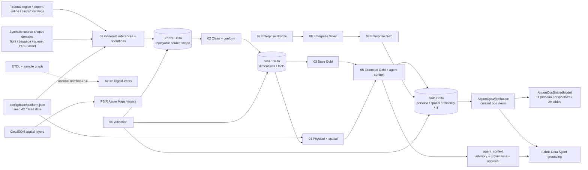
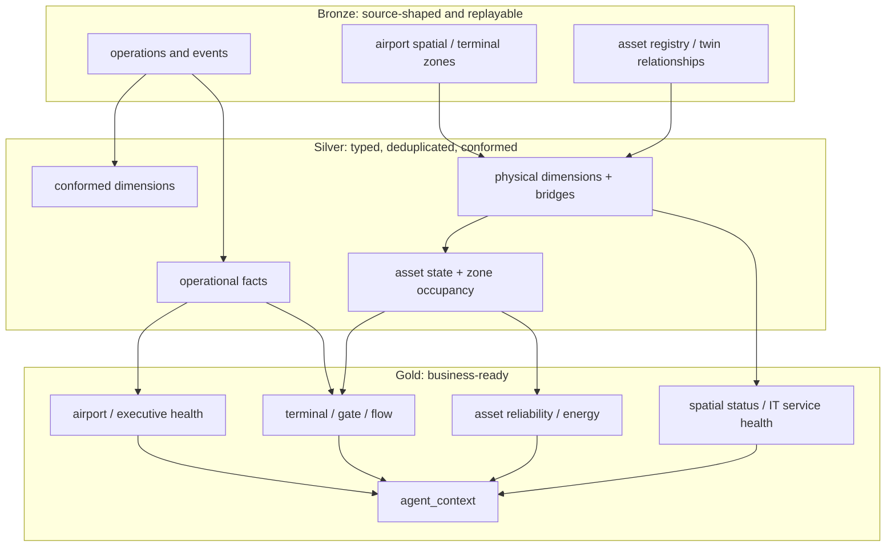
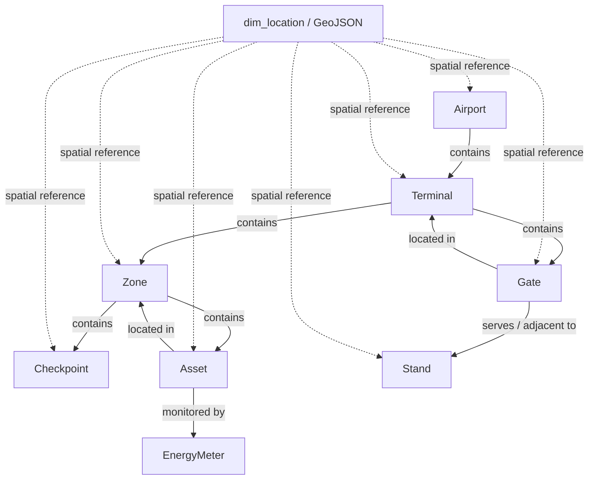
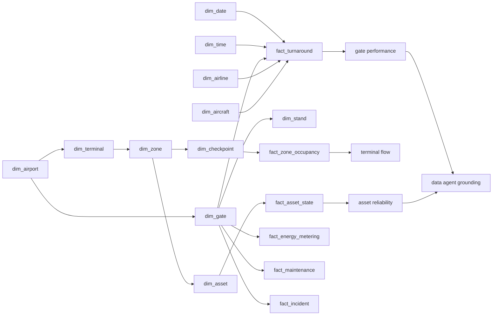
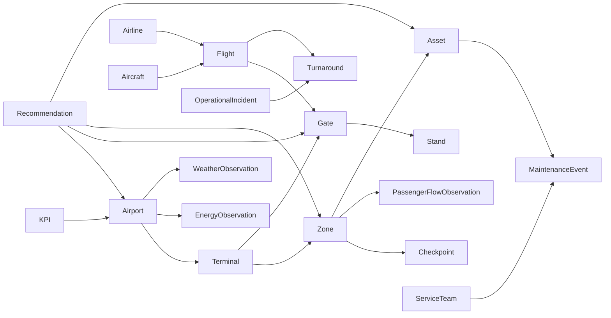
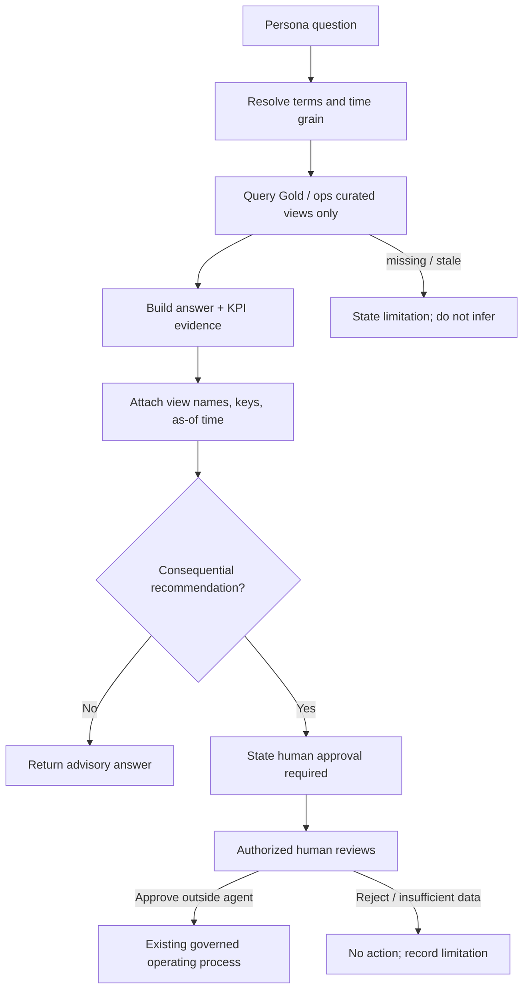
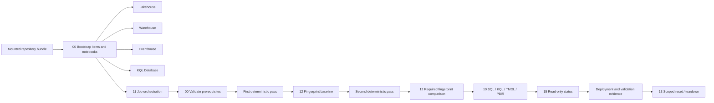

# Extended Architecture

All dimensions, relationships, operating data, coordinates, analytical outputs, and twin state are deterministic fictional data generated from configuration and seed.

## 1. End-to-end architecture

## 2. Medallion data flow

## 3. Physical and spatial hierarchy

## 4. Warehouse star schema

## 5. Ontology relationships

## 6. Agent grounding and human approval

## 7. Deployment and validation control plane

Required core APIs are fail-fast. Data Agent/Fabric app item definitions are capability-checked; Rayfin remains a disabled configurable module when no native API is available.
