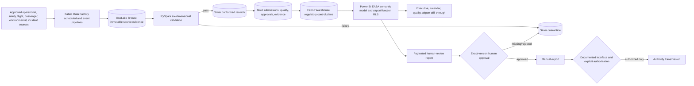

# EASA Regulatory Reporting Solution

## Current state

The governed solution foundation is deployed to the existing dev Fabric workspace. It is intentionally **blocked from regulatory use** until the annual submission inventory, rules, source contracts, owners, authority templates, and access assignments receive documented sign-off.

| Control | Current state |
|---|---|
| Approved annual submission inventory | 0 |
| Automation coverage | Not calculable |
| Coverage target | At least 78% of approved annual submission instances |
| Real-source ingestion | Disabled |
| Data Factory schedules/events | Deployed as empty shells; disabled |
| Export | Disabled |
| Authority transmission | Disabled; no authority endpoint is called |
| Semantic model endorsement | Pending tenant certification |
| Paginated report deployment | Tenant rejects documented definition format; validated RDL remains blocked |

The existing synthetic airport-operations `79.41%` KPI is not regulatory inventory coverage and is never used by this solution.

## Architecture



The transmission branch has no implementation until an official authority interface and explicit authorization are documented in the signed requirement row.

## Workspace and repository layout

```text
Fabric dev workspace
├── AirportOpsLakehouse
│   └── Files/easa
│       ├── config                 governed source and requirement snapshots
│       ├── sql                    medallion DDL
│       └── evidence/deployments   immutable deployment manifests
├── AirportOpsWarehouse
│   ├── easa                       requirements, submissions, quality, approvals, exports
│   ├── easa_audit                 evidence and pipeline runs
│   ├── easa_security              principal airport/function scopes
│   └── ops.vw_easa_*              curated Power BI and monitoring views
├── 17_EASA_Validate_Transform
├── 18_EASA_Release_Gate
├── EASA Scheduled Ingestion-Dev   disabled shell
├── EASA Event Ingestion-Dev       disabled shell
├── EASARegulatoryModel-Dev
└── EASAComplianceReports-Dev

Repository
├── config/easa_*.json
├── contracts/easa
├── data-factory
├── lakehouse/schemas/easa_medallion.sql
├── notebooks/17_* and 18_*
├── warehouse/10_easa_* through 13_easa_*
├── semantic-model/EASARegulatoryModel.SemanticModel
├── reports/EASAComplianceReports.Report
├── paginated-reports/EASASubmissionReview.PaginatedReport
├── deployment/easa-manifest.json
├── deployment/scripts/deploy_easa.py
└── tests/test_easa.py
```

## Regulatory inventory

The authoritative template is `config/easa_requirements_matrix.json`; its JSON Schema is adjacent. Every row must include:

- regulation and official citation evidence;
- submission and airport scope;
- authority, frequency, annual instance count, deadline rule, timezone, and calendar;
- approved source fields and data contract references;
- reconciliation, completeness, validity, duplicate, timeliness, and cross-field rules;
- verified authority output template;
- `ELIGIBLE` or `MANUAL` classification and manual reason;
- compliance-owner approval, timestamp, and evidence reference;
- official interface and authorization evidence before any transmission.

Approved rows containing `TODO` are rejected. An `ELIGIBLE` row must have all six quality dimensions and executable signed expressions where required.

Coverage is annual-instance weighted:

$$
\text{Coverage} = \frac{\text{approved annual instances classified ELIGIBLE}}{\text{all approved annual submission instances}} \times 100
$$

Unapproved rows do not enter either numerator or denominator. With the current zero denominator, status is `BLOCKED_NO_APPROVED_INVENTORY`, not 0% and not 79.41%.

## Data and quality controls

- Bronze is append-only and stores source URI, received timestamp, classification, actor, contract version, and SHA-256 payload evidence.
- Idempotency uses `(source_id, source_record_id, payload_sha256)`.
- Silver contains only conformed records that pass all blocking signed rules.
- Failures are appended to quarantine with requirement, airport, dimension, rule, payload hash, timestamps, and resolution evidence.
- Gold stores versioned submission snapshots, quality results, exact-version approvals, action attempts, and hash-linked evidence.
- `ops.vw_easa_submission_status` blocks release on incomplete quality, blocking failures, open exceptions, missing approval, or report-version mismatch.
- The release notebook records a readiness decision but never calls an authority endpoint.

Production source ingestion is denied by default. Enablement requires an approved source registry row, named owner, timestamp, data contract, classification, environment permission, and pipeline binding.

## Security, GDPR, retention, and lineage

- Workspace access must use Entra groups and least privilege; no user memberships are committed.
- Warehouse roles separate report readers, compliance approvers, pipeline writers, auditors, and security administrators.
- Report readers receive curated object grants only; no Bronze, Silver, payload, or quarantine-detail access.
- Power BI dynamic RLS uses `easa_security.principal_scope` and `USERPRINCIPALNAME()` for airport and function scope.
- Direct identifiers are prohibited in Gold. Passenger records require minimization and pseudonymization before Silver.
- Retention is `TODO` by jurisdiction and record class. Cleanup remains disabled until the compliance and privacy owners approve a schedule.
- Lineage is provided through Fabric item lineage plus source URI, contract version, run/correlation IDs, transformation/rule hashes, report-version hashes, approvals, exports, and OneLake deployment evidence.
- Evidence and approval tables have no update/delete grant. Immutability still depends on workspace/admin governance, capacity backup, audit-log retention, and legal-hold configuration.

## Deploy

Prerequisites:

1. Azure CLI authenticated to the intended tenant and subscription.
2. Existing Fabric workspace, Lakehouse, and Warehouse.
3. Workspace Contributor or higher and Warehouse DDL rights.
4. Python 3.12, dependencies, and Microsoft ODBC Driver 17 or 18.

From the repository root:

```powershell
python -m pip install -r requirements.txt
python -m unittest tests/test_easa.py -v
python deployment/scripts/deploy_easa.py plan --environment dev
python deployment/scripts/deploy_easa.py apply --environment dev --workspace-id $env:FABRIC_WORKSPACE_ID
```

The driver does not run Terraform. It uploads governed files to OneLake, applies idempotent Warehouse SQL, deploys item definitions, retrieves live items, validates Warehouse controls, and writes a hashed manifest to `Files/easa/evidence/deployments`.

Expected pre-sign-off result:

```text
DEPLOYED_BLOCKED_PENDING_SIGNOFF
coverage_status=BLOCKED_NO_APPROVED_INVENTORY
real_source_ingestion_enabled=false
export_enabled=false
transmission_enabled=false
```

## Configure and activate

Activate incrementally; never change all controls at once.

1. Compliance owner completes and signs the annual requirement inventory.
2. Legal/privacy owners approve jurisdictions, retention, GDPR process, classifications, and transfers.
3. Data owners approve source contracts, fields, connectors, and named connections.
4. Run tests and verify calculated coverage is at least 78%; retain the manual inventory and reasons.
5. Bind one approved dev/test source to `17_EASA_Validate_Transform`; leave schedules disabled.
6. Run synthetic and approved non-production reconciliation/data-quality tests; validate quarantine and idempotent rerun evidence.
7. Assign Warehouse roles and Power BI RLS groups; run positive and negative airport/function tests.
8. Configure approved monitoring owners/destinations and enable alerts.
9. Endorse/certify the semantic model through the tenant's governed Power BI certification process.
10. Replace the review RDL only with a verified authority template and record its hash/sign-off.
11. Enable export only after exact-version human approval is proven.
12. Implement transmission only as a separate change after official interface documentation, explicit authorization, security review, and negative tests.

## Validation

Local:

```powershell
python -m unittest tests/test_easa.py -v
python tests/validate_platform.py
python deployment/scripts/deploy_easa.py plan --environment dev
```

Runtime checks:

- all expected Fabric items retrieve uniquely;
- at least 14 `ops.vw_easa_*` views exist;
- no approved requirement contains `TODO`;
- no eligible requirement is unapproved;
- no enabled source is unapproved;
- released/exported records have passing release evidence;
- all transmission events have interface and authorization references;
- a second deployment updates in place and produces a new evidence hash.

Run `warehouse/13_easa_validation.sql` after every configuration promotion. Every returned row is a blocker.

## Monitoring and incident response

`ops.vw_easa_monitoring_alerts` emits pipeline failure, unapproved-source, blocked-release, and unauthorized-action conditions. Alert definitions are in `config/easa_monitoring.json` and remain disabled until named owners and destinations are approved.

For a critical alert:

1. Disable the affected source/pipeline or export path.
2. Preserve run IDs, source hashes, report version, approval evidence, and Fabric audit logs.
3. Quarantine the affected reporting scope.
4. Notify compliance, data, privacy, and security owners as applicable.
5. Correct through a new version; never rewrite evidence.
6. Rerun reconciliation, quality, security, and exact-version approval checks.

## Rollback

- Keep source ingestion, schedules, export, and transmission disabled during rollback.
- Redeploy the previous signed commit's item definitions and SQL views; do not delete evidence or ledger rows.
- Append a rollback evidence event with prior/new artifact hashes and the approver.
- A definition rollback does not undo source records or approvals. Supersede them with new versions and explicit status.
- Deleting Fabric items or Warehouse data is destructive and requires separate explicit approval. The deployment driver does not implement deletion.

## Compliance evidence checklist

- [ ] Signed annual requirement inventory and version hash
- [ ] Official regulation/citation evidence per row
- [ ] Authority, frequency, deadline, timezone, and calendar evidence
- [ ] Source approval, contract, field mapping, classification, and connection owner
- [ ] Six signed validation rules and rule-set hash
- [ ] Bronze source URI, payload hash, actor, and received time
- [ ] Reconciliation totals and quarantine disposition
- [ ] Submission/report version hash
- [ ] Exact-version human approval actor, function, time, decision, and evidence hash
- [ ] Semantic model endorsement and RLS test evidence
- [ ] Verified authority template and output hash
- [ ] Export actor, time, format, object reference, and hash
- [ ] Official interface and explicit transmission authorization, if applicable
- [ ] Fabric/Purview lineage screenshot or export and workspace audit logs
- [ ] Retention, legal hold, GDPR, and access-review approvals
- [ ] Deployment, validation, idempotency, monitoring, and rollback evidence

## Known blockers

- No compliance-owner-approved annual submission inventory is present, so coverage cannot be demonstrated.
- No real operational source or data contract is approved.
- No authority-specific output template is verified.
- No authority interface or transmission authorization is documented.
- Monitoring destinations and owners are not assigned.
- The semantic model is deployed but not tenant-certified.
- The current tenant rejects the documented `PaginatedReportDefinition` REST format; deploy the validated RDL through a tenant-supported Power BI/Fabric path after template verification.

These are release blockers, not implementation successes or assumed future capabilities.