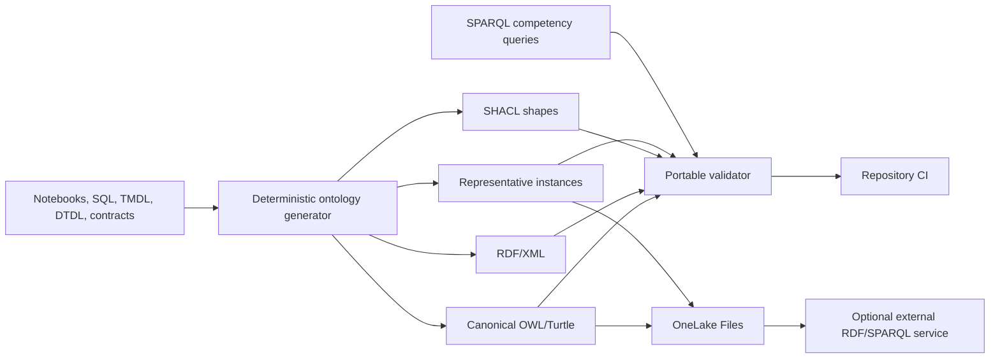

# Airport Operations OWL/RDF Ontology

This directory contains the versioned knowledge model for the repository's airport physical hierarchy, operational concepts, conformed Warehouse star schema, and governed analytical measures. The relational schemas, Spark notebooks, Warehouse SQL, TMDL, DTDL, existing ontology contracts, and checked-in reference catalogs are the source of truth.

The ontology describes the repository as it exists. It does not introduce operational capabilities, real airport layouts, real flights, or real people. Current airport and airline catalogs are public reference anchors; portfolio relationships, facilities, operations, events, measures, and representative graph relationships are fictional or synthetic.

## Artifacts

| File | Role |
|---|---|
| `airport-operations.ttl` | Canonical OWL 2 ontology in Turtle |
| `airport-operations.rdf` | Isomorphic RDF/XML serialization |
| `airport-operations.shacl.ttl` | SHACL node, datatype, cardinality, range, coordinate, and uniqueness constraints |
| `instances/airport-operations-sample.ttl` | Representative public-anchor and synthetic instance graph |
| `queries/*.rq` | Operational, spatial, analytical, and Warehouse-metadata competency queries |
| `warehouse-mapping.md` | Dimension, bridge, fact, Gold, PK/FK, grain, measure, and SCD mapping |
| `generate_ontology.py` | Deterministic generator for all generated RDF artifacts |
| `validate_ontology.py` | Syntax, equivalence, consistency, SHACL, mapping, query, and determinism validation |

Do not edit the generated `.ttl` or `.rdf` files directly. Change `generate_ontology.py`, regenerate, validate, and commit the generator and outputs together.

## Architecture



The ontology preserves five distinctions:

1. `PhysicalLocation`, `PhysicalAsset`, `BusinessEntity`, `OperationalEvent`, and `Observation` are disjoint domain categories.
2. `DimensionRecord`, `FactRecord`, `BridgeRecord`, and `AggregateProduct` describe relational analytical structures, not physical-world objects.
3. `representsEntity` and `representsEvent` connect analytical records to domain concepts without treating a row as the real-world thing.
4. `MeasureDefinition` describes formula, unit, and grain; `MeasureObservation` carries a value, subject, value type, and fixed observation timestamp.
5. `PublicReferenceAnchor` distinguishes current public airport/airline identities from fictional portfolio and operational assertions.

## Namespace strategy

| Prefix | Namespace | Use |
|---|---|---|
| `ao:` | `https://data.fictional-airport-group.example/airport-operations/ontology#` | Stable classes and properties |
| ontology IRI | `https://data.fictional-airport-group.example/airport-operations/ontology` | Ontology identity |
| version IRI | `https://data.fictional-airport-group.example/airport-operations/ontology/1.0.0` | Immutable semantic version |
| `res:` | `https://data.fictional-airport-group.example/airport-operations/resource/` | Representative instance IRIs |

The `.example` domain is deliberately non-routable and organization-neutral. Production adoption should redirect the base to an owned HTTPS domain while retaining term local names and publishing an explicit migration mapping. Source IDs are URI percent-encoded, so identical source IDs always produce identical instance IRIs.

Metadata uses `owl:versionIRI`, `owl:versionInfo`, Dublin Core Terms, PROV-O, `rdfs:label`, `rdfs:comment`, source-table/view annotations, grain, PK/FK annotations, classification, and generator version.

## OWL and SHACL responsibilities

OWL captures class hierarchy, disjointness, domains/ranges, inverses, functional relationships, and evidence-backed qualified cardinalities. The schema avoids `owl:hasKey` because common OWL-RL engines can merge individuals unexpectedly when processing literal keys. Stable identifiers remain explicit datatype properties, Warehouse classes retain `ao:primaryKey`, and SHACL enforces required values and graph-wide uniqueness.

SHACL provides closed-world constraints that OWL does not:

- exactly one identifier for representative domain nodes;
- graph-wide uniqueness by class;
- exactly one parent for terminal, zone, checkpoint, gate, and stand;
- exactly one origin, destination, and airline for a route;
- complete gate, aircraft type, airline, route, and turnaround context for a flight;
- WGS84 latitude/longitude ranges;
- complete measure value, definition, subject, and timestamp.

The validator performs an OWL-RL closure and checks disjoint-class and functional-property conflicts. This is a portable consistency check, not a claim of exhaustive OWL 2 DL theorem-prover completeness.

## Generate and validate

From the repository root with Python 3.12:

```powershell
python -m pip install -r requirements.txt
python ontology/generate_ontology.py
python ontology/validate_ontology.py
python -m unittest tests.test_ontology -v
python tests/validate_platform.py
```

Verify committed generated artifacts without rewriting them:

```powershell
python ontology/generate_ontology.py --check
```

Validation covers:

- Turtle, RDF/XML, SHACL, and instance syntax;
- Turtle/RDF/XML graph isomorphism;
- object/datatype/annotation property separation;
- OWL-RL closure, disjointness, and functional-property conflicts;
- SHACL meta-validation and representative-instance conformance;
- coverage of every existing base and enterprise ontology concept;
- presence of every mapped table in notebooks/SQL and every mapped view in Warehouse SQL;
- successful execution of every SPARQL competency query with at least one result;
- separate-process byte-stable regeneration.

## Microsoft Fabric integration

Fabric remains the system of record for Delta tables, Warehouse serving views, the TMDL semantic model, and Data Agent allowlists. Microsoft Fabric does not provide a native general-purpose RDF triple store or SPARQL endpoint in this repository. Do not present storing Turtle in OneLake as equivalent to deploying a knowledge-graph service.

Recommended integration:

1. Generate and validate RDF artifacts in CI.
2. Publish the `ontology` outputs to the Lakehouse `Files/ontology/` path through Git-driven deployment or an authenticated OneLake copy process.
3. Use the source-table/view and source-column annotations in `airport-operations.ttl` as the mapping contract for a Spark export job.
4. Materialize only approved Gold or curated `ops.vw_*` data for agent-facing graph instances. Keep passenger-, booking-, bag-, employee-, Bronze-, and Silver-level data outside that graph.
5. For small validation graphs, parse Turtle with RDFLib in a Fabric notebook. For production-scale graph traversal and SPARQL, load the validated artifacts into an approved external RDF store or graph service and govern its endpoint separately.
6. Keep the semantic model's DAX formulas authoritative. RDF measure definitions provide discovery and lineage; they do not replace the Power BI calculation engine.

Illustrative Fabric notebook validation after the files are mounted in the default Lakehouse:

```python
from rdflib import Graph
from pyshacl import validate

ontology = Graph().parse("/lakehouse/default/Files/ontology/airport-operations.ttl", format="turtle")
shapes = Graph().parse("/lakehouse/default/Files/ontology/airport-operations.shacl.ttl", format="turtle")
instances = Graph().parse("/lakehouse/default/Files/ontology/instances/airport-operations-sample.ttl", format="turtle")

conforms, _, report = validate(instances, shacl_graph=shapes, ont_graph=ontology, inference="owlrl", advanced=True)
assert conforms, report
```

Install dependencies in a governed Fabric Environment rather than adding `%pip` mutation to production notebooks. Runtime authentication, workspace IDs, and endpoints remain external configuration and are never stored in the ontology.

## Competency queries

| Query | Competency |
|---|---|
| `01-spatial-hierarchy.rq` | Traverse airport, terminal, zone, checkpoint, gate, and stand |
| `02-operational-impact.rq` | Resolve incident-to-asset-to-zone impact and work orders |
| `03-flight-context.rq` | Resolve flight, gate, aircraft type, airline, route, airports, and turnaround |
| `04-analytical-measures.rq` | Return governed values with unit, subject, value type, and as-of timestamp |
| `05-warehouse-mapping.rq` | Discover fact classes, source tables/views, grains, and primary keys |

Run any query with RDFLib by parsing the ontology and representative instances into one graph and calling `graph.query(query_text)`. The automated validator executes every checked-in query.

## Versioning policy

- Patch: descriptions, mappings, shapes, or queries change without changing term meaning.
- Minor: backward-compatible classes or properties are added.
- Major: class/property meaning, namespace, domain/range, cardinality, or identifier strategy changes incompatibly.

Regeneration is idempotent. The fixed issue date and stable blank-node identifiers prevent wall-clock and random ordering from changing outputs.

## Known source-model ambiguities

These are documented rather than guessed:

- `dim_asset` contains airport, terminal, zone, and gate columns, while `bridge_asset_location` is the only effective-dated assignment. The bridge is authoritative for historical location; generated data currently contains only current rows.
- `bridge_gate_stand` has `effective_from` and `is_current` but no `effective_to`; the source currently emits a one-to-one current assignment, not a full history.
- Other dimensions are overwritten and have no effective dates. They are current-state dimensions, not implemented SCD Type 2 dimensions.
- `delay_reason` is one primary narrative cause. No atomic multi-cause delay bridge exists.
- `fact_passenger_queue_metrics` retains a legacy checkpoint string while `fact_zone_occupancy` uses `checkpoint_id`; the latter is the conformed graph relationship.
- `dim_service_team.shift` and `dim_time.shift_name` have no explicit shift bridge. No OWL relationship is asserted from that string equality.
- `dim_passenger` and restricted facts contain pseudonymous tokens. The agent-facing graph is aggregate-only; no RDF statement implies a real person identity.
- Minimum cohort size is governance metadata but is not enforced in all Warehouse views. Consumers must suppress cohorts below the approved threshold.
- Recommendation approval is metadata only. No workflow-routing or operational action capability is modeled.
- `gold_kpi_catalog` formula text is descriptive. `semantic-model/measures.dax` is authoritative when formulas differ.
- Synthetic revenue, cost, capacity, satisfaction, and NPS values are proxy indicators, not financial, billing, tenant telemetry, or real customer records.
- DTDL sample relationships cover representative physical instances. They do not establish real airport layouts or complete production cardinalities.

See [warehouse-mapping.md](warehouse-mapping.md) for the detailed relational mapping.